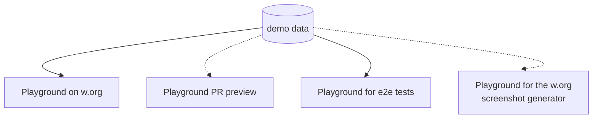

# What

This repo provides the latest version of [GatherPress](https://github.com/GatherPress/gatherpress/releases) with editable event & venue data. The created content is used as demo-data in multiple Playgrounds around the GatherPress project.

> [!NOTE]
> Help shaping GatherPress by [adding your least recent & your next upcoming WordCamp][export-to-github], you attend(ed), to our set of demo-data powered by Playground.

## How to update the demo-data:

1. [<kbd>  Open Playground  </kbd>][export-to-github]
2. Create, edit & save event & venue data
3. Export the xml to the Playground using the "💾 Save Export to server 🤖" button from the Admin bar.
4. Create a PR from inside the Playground-menu in the top-right corner
5. Back at Github, go on & merge the PR!

See the full workflow in action in this video.

https://github.com/GatherPress/demo-data/assets/198883/79c19cab-24f0-47e8-9710-832aed7938ca

### About

- **Images can only be referenced by URL**, that's why I added them to this repo and used the `raw.githubusercontent.com`-URLs [within WordPress](https://github.com/GatherPress/demo-data/issues/4#issuecomment-2083850813).
- The exported demo-data is **cleaned up ~~manually~~ automatically** from all default contents, that got added during the default WordPress installation *(inside the WordPress playground)*.
- [GitHub Proxy](https://github-proxy.com/) is a great service by @stoph.

### Inspired by

- [adamziel/playground-docs-workflow: Experimenting with maintaining WordPress docs using WordPress Playground](https://github.com/adamziel/playground-docs-workflow)
- and [bgrgicak/playground-blog: A built using WordPress Playground](https://github.com/bgrgicak/playground-blog)

### Ressources

- [Introduction to Playground: running WordPress in the browser](https://developer.wordpress.org/news/2024/04/05/introduction-to-playground-running-wordpress-in-the-browser/) – WordPress Developer Blog
- [Load Blueprint from a URL](https://wordpress.github.io/wordpress-playground/blueprints-api/using-blueprints/#load-blueprint-from-a-url) - Using Blueprints | WordPress Playground
- [Blueprint builder](https://playground.wordpress.net/builder/builder.html)
- [WordPress Playground demos](https://playground.wordpress.net/demos/index.html)
- [Blueprint examples](https://github.com/WordPress/wordpress-playground/wiki/Blueprint-examples) - WordPress/wordpress-playground Wiki
- [How to add demo content in WordPress](https://learn.wordpress.org/lesson-plan/how-to-add-demo-content-in-wordpress/) - Learn WordPress

[builder]: https://playground.wordpress.net/builder/builder.html?blueprint-url=https://raw.githubusercontent.com/GatherPress/demo-data/main/blueprints/gatherpress-save-export-to-server-blueprint.json

[export-to-github]: https://playground.wordpress.net/?blueprint-url=https://raw.githubusercontent.com/GatherPress/demo-data/main/blueprints/gatherpress-save-export-to-server-blueprint.json&gh-ensure-auth=yes&ghexport-repo-url=https://github.com/GatherPress/demo-data&ghexport-pr-action=create&ghexport-playground-root=/wordpress/wp-content/demo-data-main&ghexport-repo-root=/&ghexport-path=.&ghexport-content-type=custom-paths&ghexport-commit-message=Changes%20from%20Playground&ghexport-allow-include-zip=no
