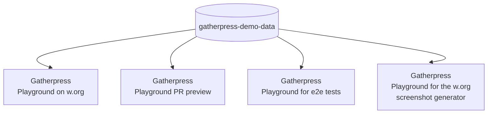

> [!NOTE]
> Help shaping GatherPress by [adding your least recent & your next upcoming WordCamp][playground-0-34-0], you attend(ed), to our set of demo-data powered by Playground.


# What

This repo provides the latest version of [GatherPress](https://github.com/GatherPress/gatherpress/releases) with editable event & venue data. The created content is used as demo-data in multiple Playgrounds around the GatherPress project.


<details><summary>mermaid diagram</summary>


```mermaid

%%{ init: { 'flowchart': { 'curve': 'natural' } } }%%
flowchart TB
    C[(gatherpress-demo-data)]
    C -->D[Gatherpress<br />Playground on w.org]
    C -->E[Gatherpress<br />Playground PR preview]
    C -->F[Gatherpress<br />Playground for e2e tests]
    C -->G[Gatherpress<br />Playground for the w.org
screenshot generator]

```

</details> 


## How to update GatherPress' demo-data:


| # | Info |  |
| --- | --- | --- |
| 1 | Select a version, to update demo-data for: | [![Update demo-data for GatherPress version 0.34.0][badge-0-34-0]][playground-0-34-0] |
| 2 | Connect your GitHub profile |  |
| 3 | Create, edit & save event & venue data | *Up to you. Why not add the next local WordPress meeting, you'll attend. Or your next WordCamp?!* |
| 4 | Export your changes using the<br>**💾 Save Export to server 🤖**<br>button from the *Admin bar*. |  |
| 5 | Use "Export to GitHub" from the ⋮ menu |  |
| 6 | That's it. ***Thanks!*** |  |

<details><summary><strong>See the full workflow in action in this video.</strong></summary>


https://github.com/GatherPress/gatherpress-demo-data/assets/198883/79c19cab-24f0-47e8-9710-832aed7938ca

</details>


<details><summary><strong>Preparing demo-data for a new version of GatherPress</strong></summary>

<hr>

This guide uses the following version-numbers for explanation:

- existing LATEST STABLE `{0.0.0}`
- existing IN DEVELOPMENT `{0.1.0}`
- wanted NEW VERSION `{0.2.0}`

Adopt this scheme for *your* next version!

<hr>

1. Duplicate latest<br>`/GatherPress-demo-data-{0.1.0}.xml`<br>into a new<br>`/GatherPress-demo-data-{0.2.0}.xml`
2. Duplicate latest<br>`/blueprints/gatherpress-{0.1.0}-demo-data.json`<br>into a new<br>`/blueprints/gatherpress-{0.2.0}-demo-data.json`
3. Update the version-number-string **6 times** in<br>`/blueprints/gatherpress-{0.2.0}-demo-data.json`
   - Once around Line 22: 
        ```json
        "wordpress_export_to_server__file": "GatherPress-demo-data-{0.1.0}.xml"
        ```
   - Twice around Line 108: 
        ```json
        "url": "https://github.com/GatherPress/gatherpress/releases/download/{0.1.0}/gatherpress.{0.1.0}.zip"
        ```
   - Twice around Line 118: 
        ```json
        "url": "https://github.com/GatherPress/gatherpress-alpha/releases/download/{0.1.0}/gatherpress-alpha.{0.1.0}.zip"
        ```
   - Once around Line 142: 
        ```json
        "url": "https://raw.githubusercontent.com/GatherPress/gatherpress-demo-data/main/GatherPress-demo-data-{0.1.0}.xml"
        ```
4. Now the hard part, update all Playgrounds & other files, that typicallly use the latest or in development version of the demo-data.

   1. [GatherPress/gatherpress](https://github.com/GatherPress/gatherpress/)<br>`.wordpress-org/blueprints/blueprint.json`<br>*This is the Playground for wordpress.org, which uses the latest stable release. Therefore this is updated from `{0.0.0}` to `{0.1.0}`*.<br>Once around Line 54: 
        ```json
        "url": "https://raw.githubusercontent.com/GatherPress/gatherpress-demo-data/main/GatherPress-demo-data-{0.0.0}.xml"
        ```
   2. [GatherPress/gatherpress](https://github.com/GatherPress/gatherpress/)<br>`.wordpress-org/blueprints/blueprint-nightly.json`<br>Once around Line 54: 
        ```json
        "url": "https://raw.githubusercontent.com/GatherPress/gatherpress-demo-data/main/GatherPress-demo-data-{0.1.0}.xml"
        ```
   3. [GatherPress/gatherpress](https://github.com/GatherPress/gatherpress/)<br>`test/e2e/RSVP-TESTS-TODO.md`<br>Twice around Line 69 & 189: 
        ```md
        <https://raw.githubusercontent.com/GatherPress/gatherpress-demo-data/main/GatherPress-demo-data-{0.1.0}.xml>
        ```
   4. [GatherPress/gatherpress](https://github.com/GatherPress/gatherpress/)<br>`test/e2e/rsvp-tests/rsvp-flows.spec.js`<br>Once around Line 35: 
        ```js
        // Demo data available at: https://raw.githubusercontent.com/GatherPress/gatherpress-demo-data/main/GatherPress-demo-data-{0.1.0}.xml
        ```
   5. [GatherPress/gatherpress](https://github.com/GatherPress/gatherpress/)<br>`.github/scripts/playground-preview/index.js`<br>Once around Line 242: 
        ```js
        url: 'https://raw.githubusercontent.com/GatherPress/gatherpress-demo-data/main/GatherPress-demo-data-{0.1.0}.xml'
        ```
   6. [GatherPress/gatherpress](https://github.com/GatherPress/gatherpress/)<br>`.github/scripts/wordpress-org-screenshots/blueprint.json`<br>Once around Line 56: 
        ```json
         "url": "https://raw.githubusercontent.com/GatherPress/gatherpress-demo-data/main/GatherPress-demo-data-{0.1.0}.xml"
        ```
   7. [GatherPress/gatherpress-awesome](https://github.com/GatherPress/gatherpress-awesome)<br>`.wordpress-org/blueprints/blueprint.json`<br>Once around Line 63: 
        ```json
        "url": "https://raw.githubusercontent.com/GatherPress/gatherpress-demo-data/main/GatherPress-demo-data-{0.1.0}.xml"
        ```
   8. Look up [GitHub search](https://github.com/search?q=org%3AGatherPress+gatherpress-demo-data%2Fmain%2FGatherPress-demo-data-&type=code) to find all *other* occurences of <br>`gatherpress-demo-data/main/GatherPress-demo-data-`

</details>

<details><summary><strong>Credits & Ressources</h4></summary>


### About

- ~~**Images can only be referenced by URL**, that's why I added them to this repo and used the `raw.githubusercontent.com`-URLs [within WordPress](https://github.com/GatherPress/gatherpress-demo-data/issues/4#issuecomment-2083850813)~~.
- The exported demo-data is **cleaned up ~~manually~~ automatically** from all default contents, that got added during the default WordPress installation *(inside the WordPress playground)*.
- [GitHub Proxy](https://github-proxy.com/) is a great service by @stoph.


### Inspired by

- [adamziel/playground-docs-workflow: Experimenting with maintaining WordPress docs using WordPress Playground](https://github.com/adamziel/playground-docs-workflow)
- and [bgrgicak/playground-blog: A built using WordPress Playground](https://github.com/bgrgicak/playground-blog)

### Ressources

- [Introduction to Playground: running WordPress in the browser](https://developer.wordpress.org/news/2024/04/05/introduction-to-playground-running-wordpress-in-the-browser/) – WordPress Developer Blog
- [Load Blueprint from a URL](https://wordpress.github.io/wordpress-playground/blueprints-api/using-blueprints/#load-blueprint-from-a-url) - Using Blueprints | WordPress Playground
- [Blueprint builder](https://playground.wordpress.net/builder/builder.html)
- [WordPress Playground demos](https://playground.wordpress.net/demos/index.html)
- [Blueprint examples](https://github.com/WordPress/wordpress-playground/wiki/Blueprint-examples) - WordPress/wordpress-playground Wiki
- [How to add demo content in WordPress](https://learn.wordpress.org/lesson-plan/how-to-add-demo-content-in-wordpress/) - Learn WordPress


</details> 

[badge-0-34-0]: https://img.shields.io/badge/Update_GatherPress_Demo-0.34.0-blue?logo=wordpress&logoColor=%23fff&labelColor=%233858e9&color=%233858e9

[playground-0-34-0]: https://playground.wordpress.net/?blueprint-url=https://raw.githubusercontent.com/GatherPress/gatherpress-demo-data/main/blueprints/gatherpress-0.34.0-demo-data.json&gh-ensure-auth=yes&ghexport-repo-url=https://github.com/GatherPress/gatherpress-demo-data&ghexport-pr-action=create&ghexport-playground-root=/wordpress/wp-content/uploads&ghexport-repo-root=/&ghexport-path=.&ghexport-content-type=custom-paths&ghexport-commit-message=Changes%20from%20Playground&ghexport-allow-include-zip=no
